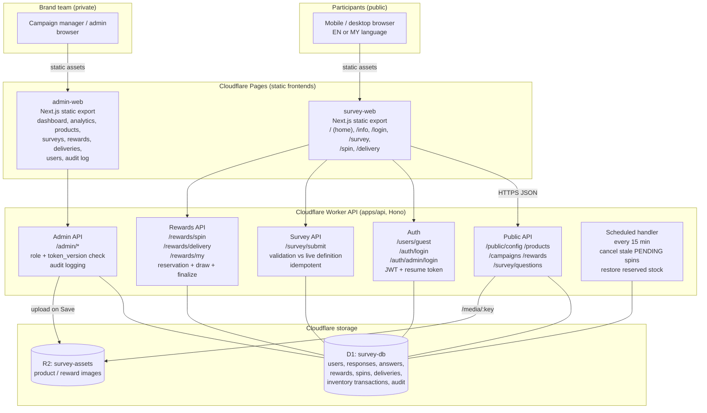
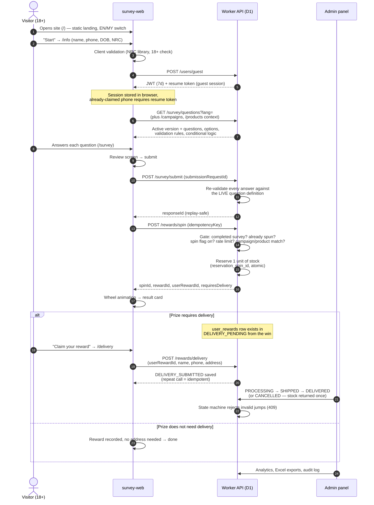
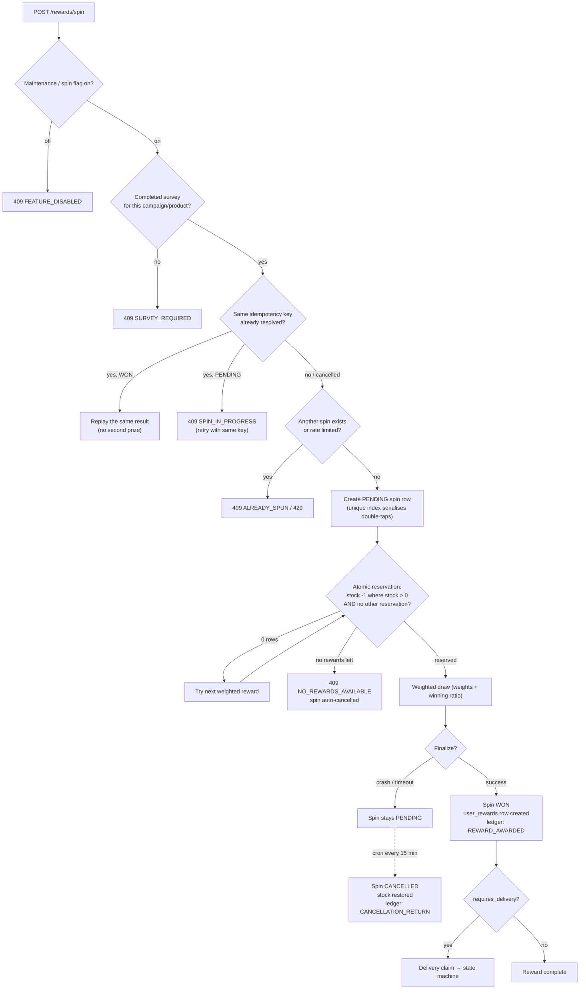
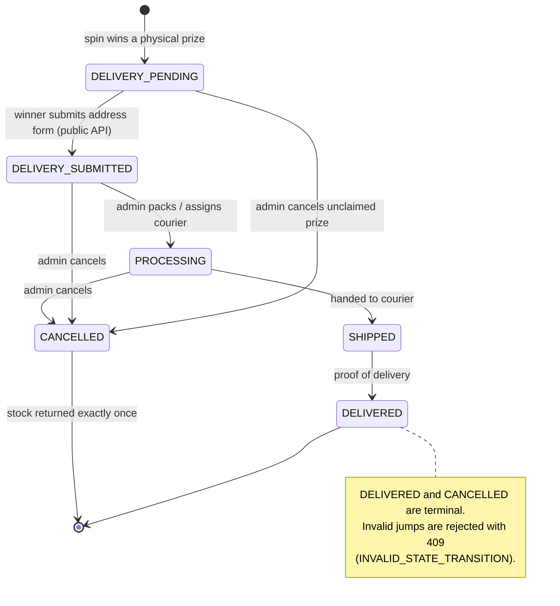

# Myanmar Beer Survey & Rewards — Working Flow, Services & Safety Guide

> **One document, three jobs:**
> 1. **Engineering** — how the whole website actually works (architecture + diagrams).
> 2. **Marketing** — what we can sell with it, the pros and cons, how to pitch it.
> 3. **Risk & Awareness** — the loopholes that could hurt the site, what already blocks them, and what must be watched before launch.
>
> **Brand:** Myanmar Beer Survey & Rewards — *"Share your opinion about Myanmar Beer products and win rewards. Good Beer, Better Moments."*
> **Audience for this file:** founders, sales/marketing, campaign managers, and the technical team — all in one place.

---

## 1. What this platform is (60-second version)

A **bilingual (English / မြန်မာ) consumer-engagement platform** that turns a brand question into a measurable reward loop:

**Ask (survey) → Reward (spin the wheel) → Fulfil (delivery tracking) → Learn (analytics & exports).**

A visitor registers with their personal details (name, phone, date of birth, NRC — 18+ only), completes a product survey, then earns exactly **one** lucky-spin attempt. Winning a physical prize opens a delivery claim that the brand's operations team then tracks from *pending* all the way to *delivered*. Every answer, prize, stock movement, and admin action is recorded in a database with an audit trail.

It is not a generic form builder: **survey completion, prize eligibility, inventory, and fulfilment are enforced on the server**, so the reward loop cannot be farmed by refreshing the page or editing browser storage.

---

## 2. System architecture



**Build & deploy path**

| Piece | Repo location | Build command | Deploy target |
|---|---|---|---|
| Public site | `apps/survey-web` | `npm run build` (static export → `out/`) | Cloudflare Pages project `alcohol-survey` |
| Admin panel | `apps/admin-web` | `npm run build` (static export → `out/`) | Cloudflare Pages project `alcohol-survey-admin` |
| API | `apps/api` | `npm run pages:build` (Pages Functions copy) + `npx wrangler deploy --config wrangler.toml --env production` (Worker + cron) | Cloudflare Worker (production API, cron) and an identical Pages Functions copy serving `/api/*` on both Pages projects |
| Database | `migrations/*.sql` | `npm run migrations:validate` then `wrangler d1 migrations apply` | D1 `survey-db` |

**Quality gates before any push** (`test.md` §0, also run by `.github/workflows/ci.yml`):
`npm run migrations:validate` → `npm test` → `npm run typecheck` → `npm run lint` → `npm run build` (+ artifact check that **no localhost URL leaks into production bundles**) → `npm run pages:build` → Worker dry-run → k6 parse check.

---

## 3. Participant journey (end-to-end)



### Stage-by-stage rules

| # | Page | What happens | Server-side protections |
|---|---|---|---|
| 01 | `/` | Brand hero, campaign steps (Survey → Spin → Receive), language switch | Static page, no API call needed |
| 02 | `/info` | Personal details: name, phone, DOB, NRC (region/township/type/serial) | **18+ rejected server-side**; NRC validated against real township data; existing phone needs **resume token** (no silent account takeover) |
| 03 | `/survey` | One question at a time, review screen, progress saved locally | Answers re-validated against the live question definition (type, options, rating bounds, required, hidden/conditional questions); duplicate submits idempotent via unique `submissionRequestId` |
| 04 | `/spin` | Wheel + prize list from live inventory | **Completed survey required** (`SURVEY_REQUIRED`); **one spin per participant per campaign** (`ALREADY_SPUN`, unique index); idempotency key replay-safe; maintenance/spin kill switch respected; stock reserved atomically before the draw |
| 05 | `/delivery` | Winner submits name/phone/address/city/township (+ optional postal code, notes) | Only physical (`requires_delivery`) prizes; only from `DELIVERY_PENDING`; delivery kill switch respected; repeat submission returns the same record (idempotent) |

---

## 4. Reward & inventory integrity (why the wheel can't be gamed)



**Key invariants (all enforced in SQL, not in the browser):**

- **One spin, one prize per participant per campaign** — a partial unique index on `reward_spins (user_id, campaign)` covers every non-cancelled spin (`idx_reward_spins_one_per_campaign`), and each win creates exactly one `user_rewards` row.
- **Stock never goes negative** — reservation is a conditional `UPDATE ... WHERE remaining_quantity > 0`, so concurrent spins cannot oversell (verified by a dedicated stock-contention test: 30 participants racing for the last unit → exactly one winner, stock exactly 0, never negative).
- **Crashes don't leak inventory** — a spin interrupted mid-flight is cancelled by the 15-minute cron and its unit returns to stock with a `CANCELLATION_RETURN` ledger entry.
- **Every stock change is accounted for** — `reward_inventory_transactions` records `REWARD_AWARDED` (−1), `CANCELLATION_RETURN` (+1) and admin `MANUAL_ADJUSTMENT` entries.

---

## 5. Fulfilment workflow (admin side)



**Admin capabilities (apps/admin-web):**

| Area | What the team can do |
|---|---|
| Dashboard | Live KPIs — responses, completion rate, rewards, delivered count; failed loads show "some data unavailable" instead of fake zeros |
| Analytics | Product popularity, average ratings, age-group breakdown, 30-day trend, product comparison |
| Products | CRUD + images (upload happens on Save, cancel rolls back) |
| Surveys | Survey **versions** (draft → activate, clone, never accidentally publish an empty version), questions of every public type (single/multiple choice, dropdown, rating, number, text, long text, yes/no), conditional logic, required rules, EN/MY translations |
| Rewards | Prize list, weights, winning ratios, total/remaining quantity, low-stock threshold, PAUSED toggle (otherwise auto `AVAILABLE` / `LOW_STOCK` / `EXHAUSTED`), stock adjustments with `MANUAL_ADJUSTMENT` ledger entries |
| Deliveries | The state machine above, filters, pagination |
| Users | Search, detail, Excel exports (survey details + user surveys) |
| Audit log | Every admin action recorded (`audit_logs`) |
| Account (`/settings`) | Profile + password change — audited as `PASSWORD_CHANGED` (note: already-issued sessions stay valid until they expire, see C8/W4) |
| Platform kill switches | `maintenance_mode`, `survey_enabled`, `spin_enabled`, `delivery_enabled` — enforced server-side on every public mutation and exposed in `/public/config`; currently settable only via `PATCH /admin/settings` (no UI yet) |

---

## 6. Data collected & stored

| Table group | Contents | Notes |
|---|---|---|
| `users` | Name, phone, DOB, age group, gender, city/township, **NRC parts**, occupation | Sensitive PII — treat exports as confidential |
| `survey_responses` / `survey_answers` | Answers tied to a version + product + campaign | Immutable history; questions are soft-deleted, never hard-deleted |
| `survey_versions` / `survey_questions` / options / conditions / translations | The live survey definition | Version pinning keeps history readable |
| `reward_spins` / `user_rewards` | Spin attempt + prize ownership | Idempotency + uniqueness keys |
| `delivery_information` | Claim address, status, timestamps | Follows the state machine |
| `reward_inventory_transactions` | Stock ledger | Every unit accounted for |
| `audit_logs` | Admin actions | For review and abuse investigations |

---

## 7. Marketing: what we can offer as a service

### 7.1 Service catalogue

| # | Service | What the client gets | Powered by |
|---|---|---|---|
| 1 | **Survey-as-a-Service** | Branded bilingual questionnaires, one-at-a-time mobile UX, conditional logic, versioned edits, live completion tracking | survey builder, versions, conditional questions |
| 2 | **Gamified Promotions (Spin-to-Win)** | "Complete the survey, spin the wheel" campaigns with controlled odds, real stock, instant result | reservation + weighted draw + cron |
| 3 | **Rewards Fulfilment Operations** | Claim capture, pending → delivered tracking, cancellation with automatic stock return, filterable deliveries queue for courier hand-off | delivery state machine + admin screen |
| 4 | **Consumer Insights & Reporting** | Dashboards (popularity, ratings, demographics, trend), Excel exports for CRM/BI | analytics APIs + exports |
| 5 | **White-label Campaign Microsite** | Own domain, own logo/colors, EN/MY, no app install, loads fast on 3G | static Pages frontends on Cloudflare edge |
| 6 | **Campaign Configuration & Ops** | We set up products, prize pool, weights, survey versions; A/B survey versions for message testing | admin panel |
| 7 | **Data Handoff / Integration** | Exports or API pull into CRM, CDP, or BI tools | REST API + Excel export |
| 8 | **Managed Hosting & Maintenance** | CI-gated deploys, migrations with backups, health endpoint, automated stale-spin recovery, load-test gate | Cloudflare + `ci.yml` + k6 |
| 9 | **Anti-fraud Hardening (add-on)** | SMS/OTP verification, WAF rate rules, admin 2FA, unique-identity rules per campaign | *roadmap — see §8.3* |

### 7.2 Campaign formats this platform fits

- **Launch & tasting feedback** — new product feedback with a prize incentive.
- **Trade/retail activations** — QR code on shelf → survey → spin → instant prize.
- **Seasonal promotions** — festival campaigns with a bounded prize pool and dates.
- **Consumer panels** — recurring research with bilingual (EN/MY) reach.
- **Loyalty & re-engagement** — returning visitors are recognised by phone (resume token), so their profile and prize history stay on one record.

### 7.3 How to pitch it (elevator lines)

1. *"Two minutes of a customer's time, in their own language, ends in a real reward — and every prize is tracked to the doorstep."*
2. *"You set the odds and the stock; the platform guarantees nobody wins twice or oversells your inventory."*
3. *"Field-ready in days: bilingual survey, prize wheel, fulfilment tracking, and a dashboard — hosted on Cloudflare's edge, so it costs almost nothing to run."*
4. *"Your consumer data, your Excel exports, your CRM — no lock-in."*

### 7.4 Engagement models (pricing is a commercial decision)

| Model | Best for | Basis |
|---|---|---|
| One-off campaign | Product launch / single promo | Fixed project fee + per-participant data fee (optional) |
| Seasonal retainer | Repeating festival/seasonal promos | Monthly retainer + prize-ops support |
| White-label licence | Agency/brand with own ops team | Annual licence + hosting |
| Insights package | Research-only (no prizes) | Per-survey + report fee |

---

## 8. Pros and cons (honest list — use in sales, do not hide the cons)

### 8.1 Pros (why choose this)

| # | Strength | Proof point |
|---|---|---|
| P1 | **Full loop in one platform** | Survey → spin → reward → delivery → analytics in a single system |
| P2 | **Integrity you can audit** | Server-enforced eligibility, atomic stock reservation, idempotent APIs, stock ledger, audit log |
| P3 | **Fair, controllable odds** | Admin sets weights, winning ratios, pool size, low-stock alerts |
| P4 | **Bilingual & local** | EN/MY interface, Myanmar NRC validation, 18+ age gate |
| P5 | **Cheap & fast to run** | Static frontends + edge API on Cloudflare; no servers to manage |
| P6 | **Mobile-first** | One-question-at-a-time flow, progress saving, works on low bandwidth |
| P7 | **No app install, no login friction** | Browser-only; returning visitors resume by phone (resume token) |
| P8 | **Ops-friendly** | Deliveries screen, exports, versioned surveys, dashboard, audit trail, and server-side kill switches (maintenance / survey / spin / delivery flags) |
| P9 | **Engineering discipline** | CI gates, typecheck/lint/build, migration validation, live API + hardening + stock-contention tests, k6 load gate |
| P10 | **Recovery is automatic** | 15-minute cron cancels stuck spins and returns inventory |

### 8.2 Cons / limitations (set expectations honestly)

| # | Limitation | Business impact | Workaround / roadmap |
|---|---|---|---|
| C1 | **No SMS/OTP verification** | Phone numbers are not proven to belong to the participant; identity is "self-declared" | Add SMS OTP before high-value prizes (§8.3) |
| C2 | **No email/SMS notifications** | Winners are not automatically messaged about delivery status | Manual contact today; notification provider is an add-on |
| C3 | **Fulfilment is manual** | Courier hand-off and status updates are typed in by staff | Courier API integration possible |
| C4 | **No payments / e-commerce** | Prizes only — cannot sell or take payment | Out of scope by design |
| C5 | **Analytics is campaign-grade, not BI-grade** | Great for campaign reporting, not deep data science | Export to BI (Excel/API) |
| C6 | **Rate limiting is per-isolate** | Under a large distributed attack, limits are approximate | Cloudflare WAF rate rules recommended |
| C7 | **Admin login is password-only** | No 2FA on the admin panel | Add Cloudflare Access / 2FA |
| C8 | **Sessions last 7 days, no logout button** | Shared-device risk in cafés/offices | Shorten TTL + logout (roadmap) |
| C9 | **Myanmar-specific identity fields** | NRC does not translate to other countries | Abstract identity fields per market |
| C10 | **Single-tenant look** | One brand identity per deployment | White-label theming work |
| C11 | **Prize pool is finite by design** | When stock hits 0 the wheel correctly returns `NO_REWARDS_AVAILABLE` | Monitor stock, set low-stock alerts |
| C12 | **Some P2 polish items open** | i18n gaps, accessibility, analytics edge cases (tracked in the audit backlog) | Staged backlog — see `CODEBASE_AUDIT_CHECKLIST.md` |

### 8.3 Before you scale: the loophole map

> Every platform owner asks the same question: *"what loopholes could ruin this website?"* Here is the complete, honest answer — grouped by **already defended**, **watch closely**, and **must add before big spend**.

#### A. Already defended (fixed in this hardening pass — do not regress)

| Loophole | How it was abused (before) | Protection now |
|---|---|---|
| **Phone-only account takeover** | `POST /users/guest` with any phone number matched that profile, overwrote its details, and returned its JWT — possible admin escalation if the admin's phone was known | Duplicate phone now demands a valid one-time **resume token** (stored on the original device; support can issue a fresh one after verifying the participant via `POST /admin/users/:id/resume-token`); admin accounts are created only via `npm run admin:bootstrap`; legacy seeded admin disabled |
| **Admin role escalation** | Role read from the DB without checking the token | Middleware checks DB role **and** `token_version` on every request |
| **Winning without doing the survey** | Spin never checked a completed response | `SURVEY_REQUIRED` gate + eligibility SQL; spin page cannot bypass it |
| **Refresh/farm to win twice** | Replay of a cancelled spin returned a fake "success" | `CANCELLED` spins are excluded from replay *and* active-spin lookups, so they can never pay out again; `PENDING` returns `SPIN_IN_PROGRESS`; unique index serialises double-taps |
| **Overselling the prize pool** | Stock decremented non-atomically; crash leaked stock | Atomic reservation + finalize + **15-min cron recovery** + stock ledger |
| **Fake delivery claims** | Any owner could re-submit; cancelled prizes resurrected | Allowed transitions only; terminal states locked; cancellation returns stock **exactly once** |
| **Editing answers in the browser** | API trusted client-supplied answer payloads | Every answer re-validated against the live question definition |
| **Deleting questions destroyed history** | Hard delete cascaded into answers | Soft delete (`is_active = 0`) only |
| **Demo data / known admin password in production** | Migration 0003/0004/0006 seeded `admin/admin` + fake winners | Migration 0015 deletes demo users/responses/rewards/ledger rows and disables the legacy seeded admin — but only while it still uses the known weak password |
| **Localhost leaking into production** | `.env.local` baked `http://localhost:8787` into shipped bundles | Production build guard + artifact check in CI |
| **Broken/oversized exports** | Survey export crashed; limits rejected | Export paging with a 10,000-row safety cap; validated limits |

#### B. Watch closely (open, low-to-medium severity — operational discipline is the defence)

| # | Risk / loophole | Why it matters | What to do |
|---|---|---|---|
| W1 | **Sybil entries** — one person using many phone numbers/NRCs gets many spins | Prizes drain to a small group; data gets polluted | Enforce **unique phone + unique NRC per campaign** (server rule) before prize-heavy campaigns; cross-check duplicates in the Users screen and exports |
| W2 | **Rate limits are per-isolate** (global shared limiter disabled) | A distributed script can slip past per-node counters | Add Cloudflare WAF rate-limiting rules on `/users/guest`, `/rewards/spin`, `/survey/submit` |
| W3 | **Admin password is the only key** | A leaked password = prize pool + PII + exports | Long unique password (never `admin/admin`), store in a password manager, rotate after staff changes, watch the **audit log**; ideally front admin with Cloudflare Access |
| W4 | **7-day JWT, no logout — and password change does not end live sessions** | A shared/public device keeps its session for up to 7 days; changing the admin password does **not** invalidate already-issued JWTs (only a `token_version` bump does, and nothing bumps it for admins) | Roadmap: logout button, shorter TTL, bump `token_version` on password change; meanwhile avoid shared devices for admin |
| W5 | **PII exposure via exports** | Names, phones, DOB, NRC in one spreadsheet | Exports are admin-only and logged; keep files in access-controlled storage; delete when the campaign ends |
| W6 | **Admin mis-set odds** | A weight typo can give away the whole pool | Pre-launch checklist: verify weights, ratios, total quantity; set `low_stock_threshold`; test with the k6 + hardening suites in staging |
| W7 | **Migrations on production** | Re-running old seed migrations would recreate demo/admin data | Always back up (D1 time-travel bookmark) first; apply only ordered new migrations; never replay 0003/0004/0006 |
| W8 | **CORS/origin config** | Wrong `ALLOWED_ORIGINS`/`PUBLIC_SITE_ORIGIN` = the live site can't reach the API (or too many sites can) | Update both values for the real domain at deploy; keep the list minimal |
| W9 | **Client-side checks are UX, not security** | Anything in the browser can be edited | Server re-validates everything — keep it that way in future PRs; run the live API suites before release |
| W10 | **Stuck external dependencies** | No courier/notification/SMS provider exists yet | Add-ons in §8.3; plan before promising "real-time delivery updates" to a client |

#### C. Must add before high-value campaigns (roadmap from the audit backlog)

1. **SMS/OTP verification** (or at minimum, unique-phone + unique-NRC enforcement) — closes the identity loophole completely.
2. **CAPTCHA / bot challenge on the entry form** — stops scripted registrations.
3. **Admin 2FA** (or Cloudflare Access in front of `/admin`).
4. **Cloudflare WAF rate rules** + enable a global (KV-backed) rate limiter.
5. **Participant consent notice + privacy/retention policy** — we collect name, phone, DOB, NRC; publish what is collected, why, and when it is deleted.
6. **Notification provider** (SMS) for prize/delivery updates.
7. **Shorter sessions + logout** on shared devices.
8. **Backup automation** + a documented restore drill.

### 8.4 Responsible-use awareness (for participants and for the brand)

Because this is an **alcohol brand** promotion, these are not optional:

- **18+ only** — enforced server-side on registration; keep it visible on the entry page.
- **Alcohol marketing codes** — no imagery or messaging that appeals to minors; prize incentives must not target under-18 audiences.
- **Promotion terms** — publish rules: eligibility region, one prize per participant, prize-not-exchangeable-for-cash, campaign dates, stock limits, and how the odds work.
- **Data transparency** — tell participants exactly what is collected (name, phone, DOB, NRC, survey answers) and how it is used; keep NRC collection defensible (needed for prize verification) or make it optional where law allows.
- **Fair-play statement in the UI** — "one spin per participant per campaign; automated entries are blocked; organisers may disqualify duplicate identities."
- **Regulatory check** — confirm local promotion/lottery/sweepstakes rules in each market before launch.

---

## 9. Pre-launch checklist (run this before every campaign)

```text
□ Back up D1 (time-travel bookmark) before any migration
□ Migrations applied in order; `npm run migrations:validate` green
□ Admin account created via `npm run admin:bootstrap` — strong password, stored securely
□ Demo/seed data absent (migration 0015 rules); no admin/admin anywhere
□ `ALLOWED_ORIGINS` + `PUBLIC_SITE_ORIGIN` set to the real domain
□ Reward pool: weights, winning ratios, total quantity, low-stock threshold reviewed
□ Campaign start/end dates and active status verified
□ Survey version activated (not an empty draft); EN + MY text reviewed
□ Age gate (18+) and promotion terms visible
□ Production build artifact check passes (no localhost in bundles)
□ CI green: migrations:validate, npm test, typecheck, lint, build, pages:build, Worker dry-run
□ Live API + hardening suites run against a staging API
□ k6 load gate run for expected traffic
□ WAF rate rules configured (until global rate limiting exists)
□ Exports/PII storage access limited to the campaign team
□ Backup + restore drill documented
```

---

## 10. Where things live in the repo

| Concern | Path |
|---|---|
| API (Hono Worker) | `apps/api/src/` — `routes/` (public, auth, survey, rewards, admin), `lib/` (auth, security, validation, survey) |
| Public site | `apps/survey-web/app/` — `page.tsx`, `info`, `survey`, `spin`, `delivery`, `login` |
| Admin panel | `apps/admin-web/app/` — `dashboard`, `analytics`, `products`, `surveys`, `rewards`, `deliveries`, `users`, `audit`, `settings` |
| Database schema | `migrations/*.sql` (ordered; `0015_security_reservations_and_demo_cleanup.sql` is the hardening migration) |
| Tests | `tests/api-tests.mjs`, `tests/hardening.test.mjs`, `tests/config.test.mjs` |
| Quality gates | `.github/workflows/ci.yml`, `scripts/` (build, artifact check, migration validation, admin bootstrap) |
| Audit backlog | `CODEBASE_AUDIT_CHECKLIST.md` (56 fixes + 28 additions; P0/P1 fixed on `fix/audit-p0-p1`) |
| Operations docs | `README.md`, `PRODUCTION_HARDENING.md`, `LOAD_TESTING.md`, `test.md` |

---

*Document generated for the current working tree of the Myanmar Beer Survey & Rewards platform. Diagrams are Mermaid — they render on GitHub, GitLab, VS Code (Markdown preview), and most documentation tools.*
